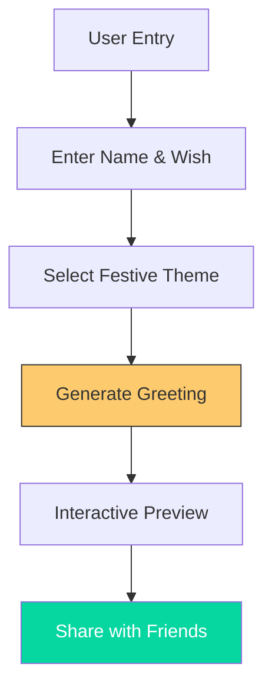

# 🏮 Diwali Greeting Generator

  
  
  

 

Celebrate the Festival of Lights with a custom-generated greeting! This interactive web app allows users to create and share beautiful Diwali cards with personalized messages.

---

## ✨ Creative Flow

---

## 🌟 Features
- **🎨 Custom Canvas**: Multiple festive background themes with high-quality assets.
- **✍️ Personalized wishes**: Dynamic text injection for names and greetings.
- **🎇 Visual Splendor**: CSS3-powered firework and diya animations.
- **🔗 Shareable Links**: Generate custom URLs to send directly to loved ones.

## 🚀 Live Demo
Create your greeting here: **[kodge0001.github.io/diwali](https://kodge0001.github.io/diwali/)**

---
*Developed by [Anurag Kodge](https://github.com/Kodge0001)*
